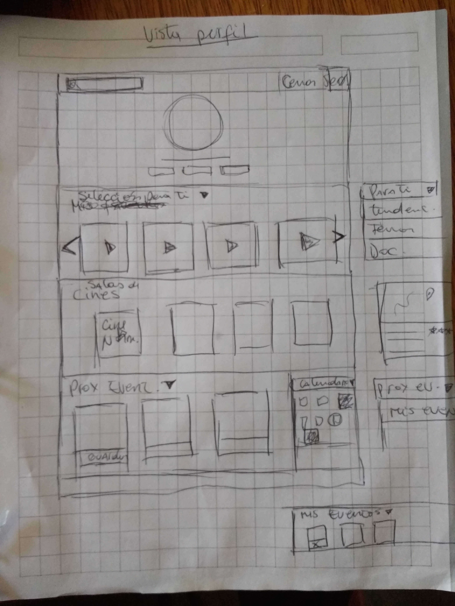

# Proyecto Hackaton **7° Arte**

##### Esta app web esta diseñada para quienes desean una experiencia especial a la hora de ir al cine, poder ver ciertas películas que no llegan a los grandes cines y solo las encuentran en los clásicos cines artes. Además la app permitira entregar información de las actividades extras que se realizan en estos espacios.

***

###### La app web  contiene dos `HTML` (una vista sin registrarse y una del usuario ya regustrado) y se divide secciones `<section>`.

## 1-Investigación

## 2-Definición del usuario

· Al usuario que va enfocado este producto es al que va frecuentemente a salas de cine arte y a un usuario curioso que busca alternativas al cine tradicional.
Por qué  van a los cine artes:
* Busca economía (bajo costo en el valor de las entradas)
* Ambiente más íntimo
* Ambiente tranquilo
* Tienen la posibilidad de asistir a otras actividades en el cine
* Gusto por lo vintage, clásico, lo retro…
*Películas de cine independiente o poco conocidas

<<<<<<< HEAD
## 3-Definición del usuario
=======
## 3-Diseño
>>>>>>> 18723459571093cae23f2a5195e6205152de7493

- Recursos:

· bootstrap
· google font
· jquery

#### Por Natalia, Vane, Vale y Yasna
